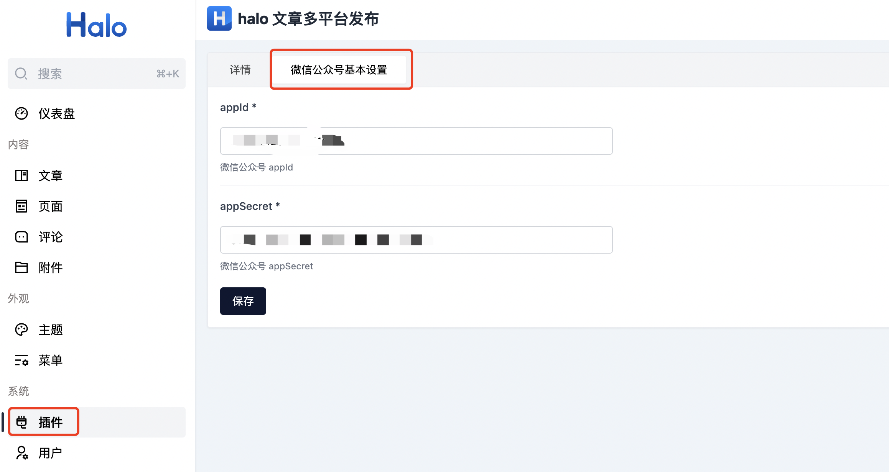
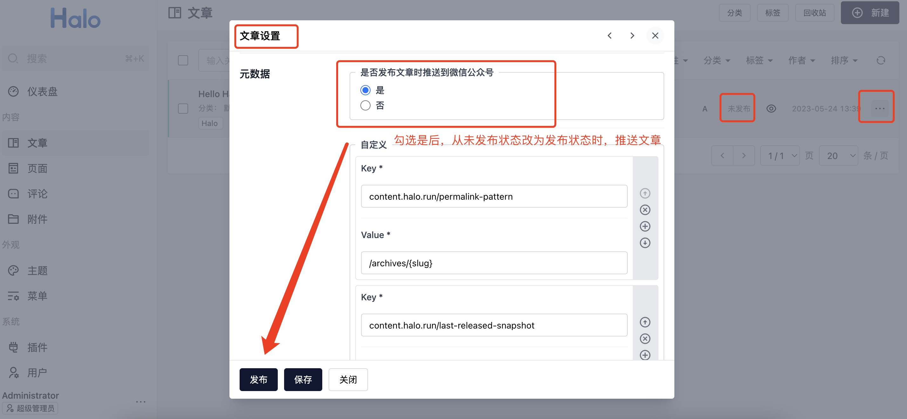
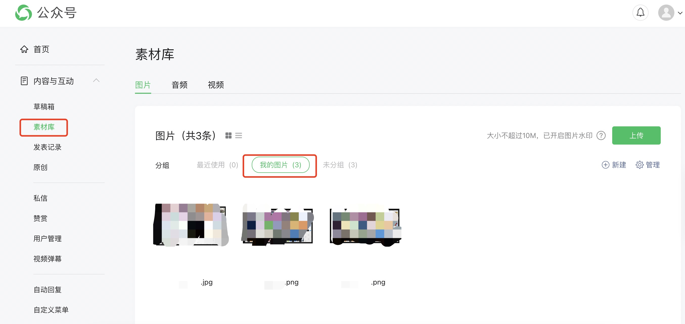
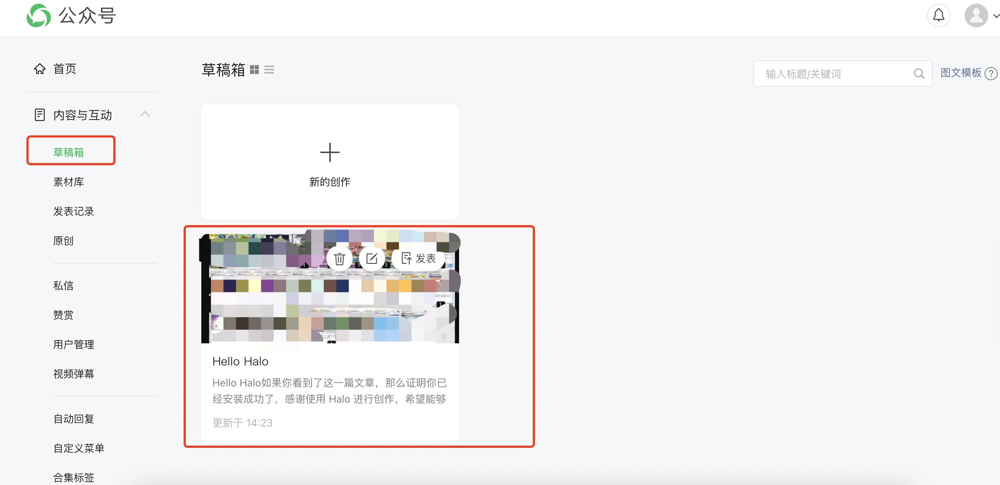

# plugin-platforms-release

Halo 2.0 多平台发布插件

## 功能特点

Halo 的文章在发布时可以同步到其他平台（目前仅支持同步到微信公众号）

## 如何使用

准备工作：
需要有微信公众号（订阅号或服务号均可）,并且在公众号后台的「基本设置」IP 白名单中添加 Halo 所在服务器 IP 地址，作为调用微信公众号 API 的条件。

安装插件之后
1、点击插件配置中的「微信公众号基本配置」，填写需要发布到微信公众号的 appId 和 appSecret，并保存。
需要在 Halo 配置文件配置好 external-url 参数为 Halo 服务访问地址，比如本地则是 http://localhost:8090 和 use-absolute-permalink 参数设置为 true。
;

2、在文章的 文章设置--元数据 处选择「是否发布文章时推送到微信公众号」的单选框，比如选中是，再点击保存。（注意：文章的封面图必须设置，封面图以及文章内图片不要用中文命名）

3、当文章从「未发布」状态转向「发布」状态时，则会触发将文章同步到微信公众号的草稿箱中，用户可以将草稿箱中的文章选择发布或者群发。
;

4、推送之后可以登录到公众号平台，查看草稿箱，可以选择将草稿箱的文章群发或者是普通发布。（文章内涉及的图片已经自动上传到了素材库）
;
;


## 获取插件方式
### 在 Release 下载最新
### 使用 workflows 打包
### 本地打包
下载源码后，执行以下命令
```
./gradlew build
```

构建完成之后，可以在 build/libs 目录得到插件的 JAR 包，在 Halo 后台的插件管理上传即可。


